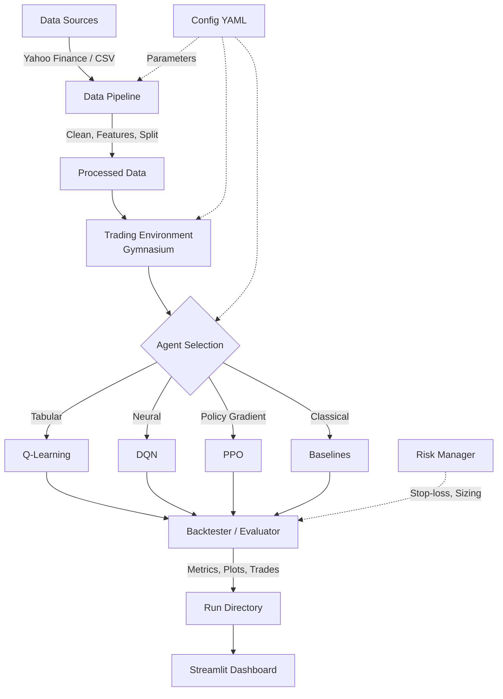

# Architecture

## System Overview

The Autonomous AI Trading Bot is a modular Python system that implements
reinforcement learning for financial trading, comparing RL agents against
classical baseline strategies.

## Module Breakdown

### `src/data/`
- **`fetch_yfinance.py`** — Downloads OHLCV from Yahoo Finance.
- **`schema.py`** — Validates DataFrames (columns, types, NaN checks).
- **`preprocess.py`** — Orchestrates: load → features → split → scale → save.
- **`features.py`** — Technical indicators: returns, SMA, EMA, RSI, MACD, ATR,
  volatility, volume features.

### `src/env/`
- **`trading_env.py`** — Custom `gymnasium.Env` with discrete actions
  {Hold, Buy, Sell}. Observation is a windowed feature vector plus portfolio
  state (position, cash fraction, value fraction).
- **`wrappers.py`** — `ContinuousActionWrapper` for PPO continuous variant;
  `SB3CompatWrapper` for Stable-Baselines3 compatibility.
- **`reward.py`** — Pluggable reward functions: log-return (with drawdown
  penalty and cost deduction) and rolling Sharpe.

### `src/agents/`
- **`qlearning.py`** — Tabular Q-learning with configurable state discretisation
  (binning). Fits bin edges from an initial exploration episode.
- **`dqn.py`** — Deep Q-Network with experience replay, target network,
  epsilon-greedy schedule. Optional Double DQN (action selected by policy net,
  evaluated by target net).
- **`ppo.py`** — Proximal Policy Optimisation via Stable-Baselines3. Supports
  both discrete and continuous action spaces.

### `src/baselines/`
- **`buy_hold.py`** — Invest all capital at day 1, hold until the end.
- **`ma_crossover.py`** — SMA crossover: buy when fast > slow, sell when slow > fast.

### `src/risk/`
- **`risk_manager.py`** — Stop-loss (percent or ATR-based), position caps,
  leverage limits, transaction-cost application.
- **`position_sizing.py`** — Fixed-fraction and volatility-targeting sizing.

### `src/eval/`
- **`backtester.py`** — Unified evaluation loop for any agent/baseline.
- **`metrics.py`** — Cumulative return, annualised return/vol, Sharpe, max
  drawdown, win rate, trade count, exposure time.
- **`plots.py`** — Plotly charts: equity curves, drawdown, trade markers,
  positions, training curves, metrics tables.

### `src/dashboard/`
- **`app.py`** — Streamlit app with tabs: equity curves, drawdown, trades on
  price, positions, metrics comparison table.

### `src/cli/`
- CLI entry points for each pipeline stage (download, preprocess, train,
  evaluate, baselines, full pipeline).

### `src/utils/`
- **`config.py`** — YAML loading with deep merge, typed dataclasses.
- **`logging.py`** — Rich-powered logger.
- **`paths.py`** — Centralised path management.
- **`seeds.py`** — Global deterministic seeding (Python, NumPy, PyTorch).

## Data Flow

1. **Download** → `data/raw/<symbol>/ohlcv.csv`
2. **Preprocess** → `data/processed/<symbol>/` containing:
   - `train.csv`, `val.csv`, `test.csv` (normalised)
   - `train_raw.csv`, `val_raw.csv`, `test_raw.csv` (original scale)
   - `scaler.pkl`, `feature_cols.json`
3. **Train** → `runs/<timestamp>_<algo>_<symbol>/` with model checkpoints
4. **Evaluate** → same run dir gets metrics, trades, plots, summary
5. **Dashboard** → reads from `runs/` directories

## Leakage Prevention

- Time-based split: train is strictly before val, val before test.
- StandardScaler is fitted on the **training set only**; the same
  transform is applied to val and test.
- No future-looking indicators are used in feature computation.
- Windowed observations only look backwards.
